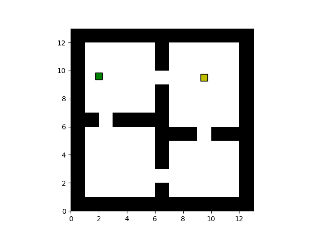
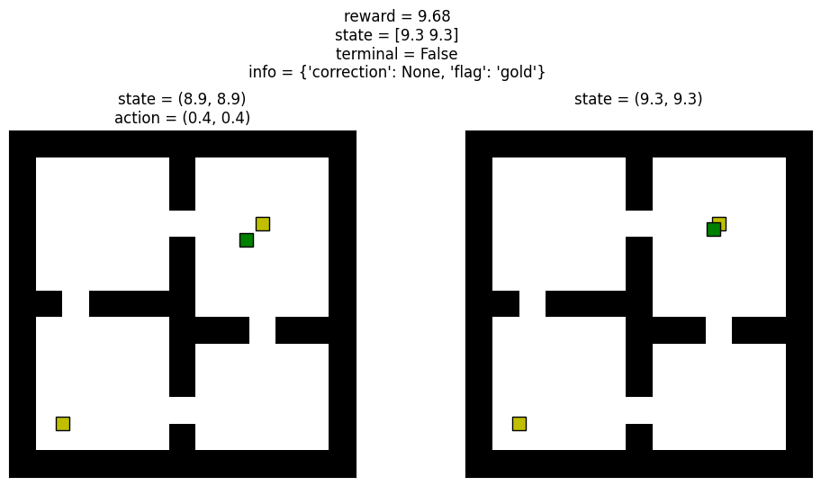

# Continuous GridWorld

A simple continuous gridworld environment constructor.

## Usage

```python
from   continuous_gridworld.envs   import FourRooms
from   continuous_gridworld.events import SquareGold

gold   = SquareGold(loc = (9.5, 9.5))
events = [gold]

env    = FourRooms(events = events)

env.render()
```
<p align="center">
  
</p>

<br>
<br>

### Demo Function

<br>

```python
from matplotlib import pyplot as plt, animation

def animate(configs, interval = 50):
    """helper function to create demo animations"""
    
    fig, ax = plt.subplots()

    _, ax, objects, patches = env.render(ax = ax)

    count  = 0
    def func(i):
        nonlocal count
        env.set_config(*configs[i])
        ax.clear()
        env.render(ax = ax)
        fig.canvas.draw()

        if i:
            ax.set_xlabel(info)
            count += configs[i][2]['correction'] is not None
        
        if count:
            ax.set_title(f'hit wall {count} times')

    ax.set_xticks([])
    ax.set_yticks([])

    plt.close()

    anim = animation.FuncAnimation(fig, func, len(configs), interval = interval)

    return anim
```
<br><br>

### Moving towards goal until termination

<br>

```python
import numpy as np

np.random.seed(12)

state    = env.reset()
terminal = env.terminal
configs  = [env.get_config()]

while not terminal:
    action = np.clip(gold.loc - state, -0.05, 0.05)
    reward, state, terminal, info = env.step(action)
    configs.append(env.get_config())
    
anim = animate(configs)

anim.save('four-rooms-get-gold.gif')
```

<p align="center">
  
</p>

<br>

Upon reaching the gold state, the final `info` value is:

```{'correction': None, 'flag': 'gold'}```

The `info` dictionary will always contain two entries:

  + correction : an array which needed to be added to the action array to ensure we do not go into a wall
  + flag : a string which indicates which special object we may have collided with or `None`


<br><br>

### Moving towards a wall

<br>

```python
np.random.seed(12)

state   = env.reset()
configs = [env.get_config()]

count = 0
while count < 20:
    reward, state, terminal, info = env.step((-0.05, 0.02))
    configs.append(env.get_config())
    count += info['correction'] is not None
    
anim = animate(configs, interval = 100)

anim.save('four-rooms-to-wall.gif')
```
<br>
<p align="center">
  
</p>

<br><br>

## Multi-Goal condition

<br>

Suppose we would like two gold locations and termination only happens when both are collected. When a special state is reached, it's flag is appended to a list of flags within the environment. By creating our own terminal function, we can use the list of flags to determine when we have reached a terminal condition. In the below example, we need to have reached two states collecting the flag 'gold' twice.

<br>

```python
def terminal_func(flags):
    return flags.count('gold') == 2

locs    = [(9.5, 9.5), (2, 2)]
events  = [SquareGold(loc = loc) for loc in locs]
initial = (8.9, 8.9)

env     = FourRooms(events = events, initial_states = [initial], terminal_func = terminal_func)

env.reset()

# two subplots for before and after gold collection
fig, ax = plt.subplots(1, 2, figsize = (12, 5))

# before gold collection
env.render(ax[0])

# step into gold location and confirm not a terminal state
action = (0.4, 0.4)
reward, state, terminal, info = env.step(action)

# after gold collection
env.render(ax[1])

sup = fig.suptitle(f'reward = {reward}\nstate = {state}\nterminal = {terminal}\ninfo = {info}', y = 1.15)

# remove ticks
for axes in ax:
    axes.set_xticks([])
    axes.set_yticks([])

ax[0].set_title(f'state = {initial}\naction = {action}')
ax[1].set_title(f'state = {tuple(env.state)}\n')
```

<br>
<p align="center">
  
</p>

<br><br>

## Custom Layout

<br>

Users can create custom layouts by creating their own layout in string. Walls are denoted with the '#' character.

<br>

```python
from continuous_gridworld.env import BaseEnv

custom = """
#############
#     #     #
#     #     #
#     #     #
#     #     #
#           #
#############
"""

BaseEnv(custom).render()

plt.savefig('custom.png', dpi = 400)
```

<p align="center">
  
</p>
