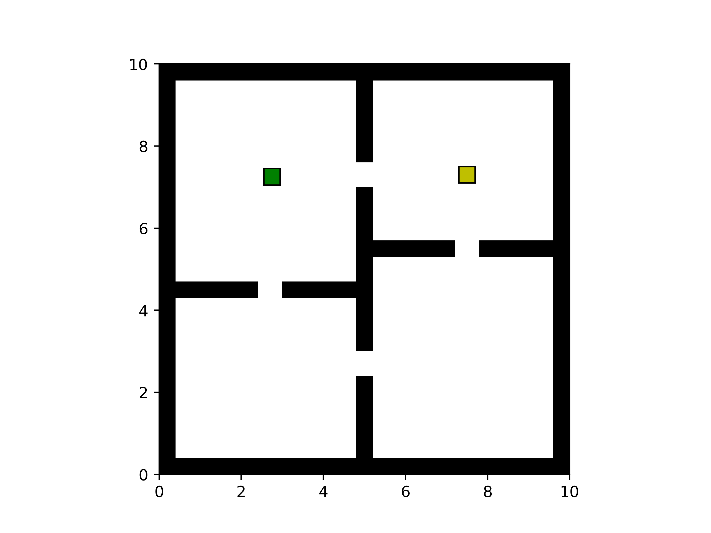
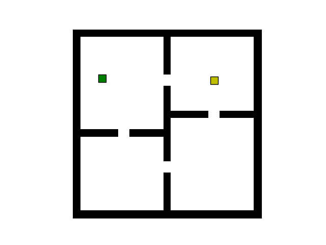
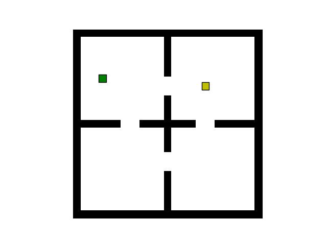

# Continuous GridWorld

A simple continuous gridworld environment constructor.

## Usage

```python
from   continuous_gridworld.envs import FourRooms

from   matplotlib                import pyplot as plt, animation

import numpy as np

reward = 10
loc    = (7.5, 7.3)
kwargs = dict(fc = 'y', ec = 'k')

states = [[reward, loc, kwargs]]

env    = FourRooms(terminal_states = states)

env.render()
```
<p align="center">
  
</p>

<br>
<br>

### Demo Function

<br>

```python
def animate(gridworld, locs, interval = 50, wall_count = False):
    """helper function to create demo animations"""

    fig, ax, objects, patches = gridworld.render()

    # compute offset between bottom left corner and midpoint of rectangular agent patch
    offset = objects[-1].xy - objects[-1].loc

    count  = 0
    def func(i):
        nonlocal count
        patches[-1].set_xy(locs[i] + offset)
        fig.canvas.draw()
        count += (locs[i] == locs[i - 1]).any()
        if wall_count and count:
            ax.set_title(f'hit wall {count} times')

    ax.set_xticks([])
    ax.set_yticks([])

    plt.close()

    anim = animation.FuncAnimation(fig, func, len(locs), interval = interval)

    return anim
```

<br><br>

### Moving towards goal until termination

<br>

```python
np.random.seed(12)

locs     = [env.reset()]
terminal = env.terminal

while not terminal:
    action = np.clip(env.terminal_states[0][1].loc - locs[-1], -0.05, 0.05)
    reward, state, terminal = env.step(action)
    locs.append(state)
    
anim = animate(env, locs)

anim.save('four-rooms-get-gold.gif')
```

<p align="center">
  
</p>

<br><br>

### Moving towards a wall

<br>

```python
np.random.seed(12)

locs  = [env.reset()]
count = 0
while count < 20:
    reward, state, terminal = env.step((-0.05, 0.02))

    # check to see if new state is same as old state (i.e. move into wall)
    count += (state == locs[-1]).any()
    
    locs.append(state)
    
anim = animate(env, locs, interval = 100, wall_count = True)

anim.save('four-rooms-to-wall.gif')
```
<p align="center">
  
</p>